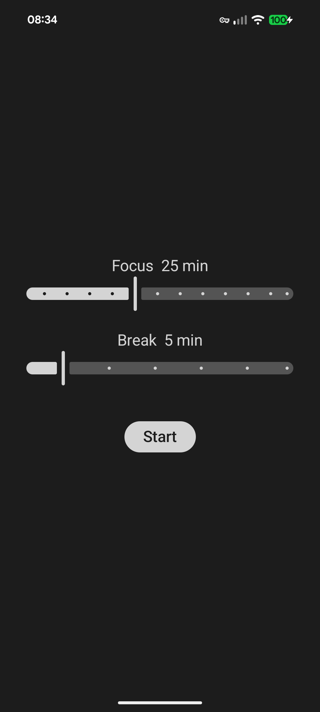

# Pomodoro

Android Pomodoro timer that **fully blocks the phone** during a session. One
screen: set Focus (1–60 min) and Break (1–30 min), press Start. No pause, no
cancel, no leaving the app until the session ends. Emergency calls still work
(OS-guaranteed).

How it blocks: an accessibility service bounces any other app straight back,
device admin locks the screen if the service gets disabled mid-session and
blocks normal uninstall.

| Idle | Running |
|---|---|
|  |  |

## Build

Requires JDK 17+ and the Android SDK (`local.properties` → `sdk.dir`).

```sh
./gradlew :app:assembleRelease
```

APK: `app/build/outputs/apk/release/app-release.apk` (signed with the debug
key — swap in a real keystore before distributing).

## Install

```sh
adb install -r app/build/outputs/apk/release/app-release.apk
```

On first launch tap **Grant permissions** — it walks you through enabling the
accessibility service and device admin in system settings. Both are required
before Start appears.

## Uninstall

Device admin blocks normal uninstall. First deactivate it under
*Settings → Security → Device admin apps → Pomodoro*, then uninstall as usual.

## Notes

- A session survives nothing: killing the process or rebooting ends it (no resume).
- minSdk 26, targetSdk 36. Kotlin + Jetpack Compose, no backend, settings stored on-device via DataStore.
